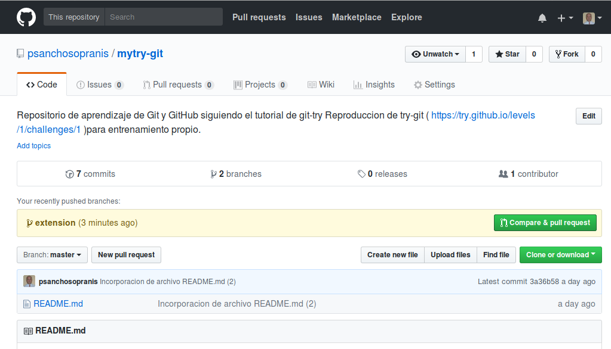
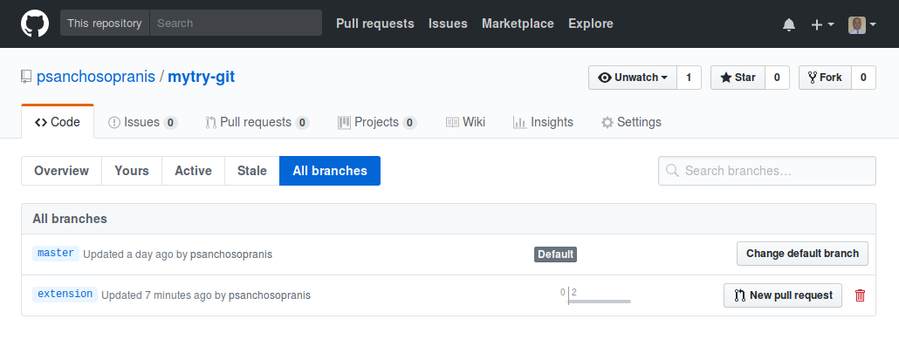
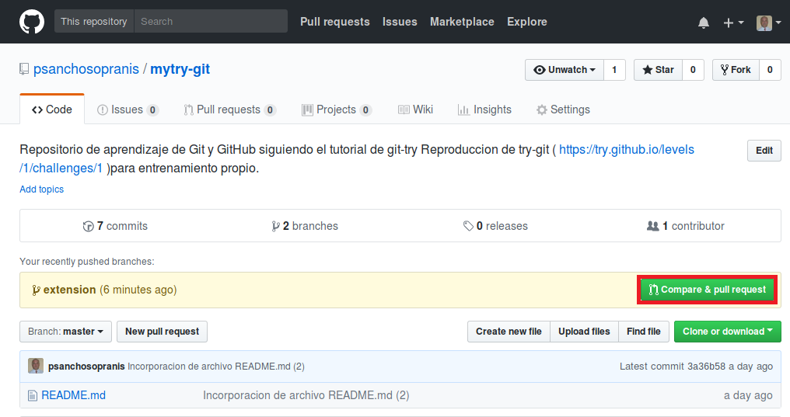
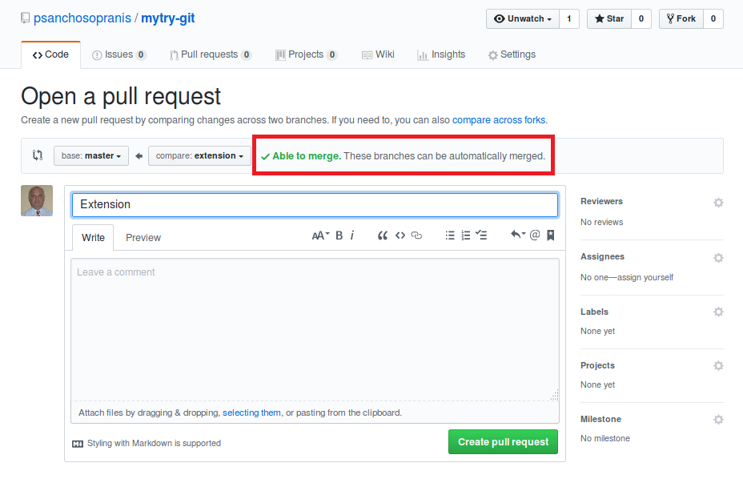

# MYTRY-GIT

Reproduccion de [try-git](https://try.github.io/levels/1/challenges/1) para entrenamiento propio.


### 1.1 Got 15 minutes and want to learn Git?

Git allows groups of people to work on the same documents (often code) at the same time, and without stepping on each other's toes. It's a distributed version control system.

Our terminal prompt below is currently in a directory we decided to name "octobox". To initialize a Git repository here, type the following command:

```sh
git init
```
>Advice
>
>**Directory:**
>A folder used for storing multiple files.
>
>**Repository:**
>A directory where Git has been initialized to >start version controlling your files.


```sh
devel@vbxdeb8:~/Escritorio/git_tutorial/mytry-git$ git init
Initialized empty Git repository in /home/devel/Escritorio/git_tutorial/mytry-git/.git/
```
>Advice
>
>**The .git directory** 
>
>You'll notice a `.git` directory. It's 
usually hidden but we're showing it to you for convenience.
> 
>You'll notice it has all sorts of directories and files inside it. You'll 
rarely ever need to do anything inside here but 
it's the guts of Git, where all the magic 
happens.

Estado del directorio después de realizar `git init`

```sh
$ ls -la .git/
total 40
drwxr-xr-x 7 devel devel 4096 abr 21 18:34 .
drwxr-xr-x 3 devel devel 4096 abr 21 18:33 ..
drwxr-xr-x 2 devel devel 4096 abr 21 18:33 branches
-rw-r--r-- 1 devel devel   92 abr 21 18:33 config
-rw-r--r-- 1 devel devel   73 abr 21 18:33 description
-rw-r--r-- 1 devel devel   23 abr 21 18:33 HEAD
drwxr-xr-x 2 devel devel 4096 abr 21 18:33 hooks
drwxr-xr-x 2 devel devel 4096 abr 21 18:33 info
drwxr-xr-x 4 devel devel 4096 abr 21 18:33 objects
drwxr-xr-x 4 devel devel 4096 abr 21 18:33 refs
```

### 1.2 Checking the Status
Next up, let's type the `git status` command to see what the current state of our project is:
```sh
git status
```

```sh
$ git status
On branch master

Initial commit

nothing to commit (create/copy files and use "git add" to track)


### INTERLUDIO: STATUS EN PROFUNDIDAD

```sh
$ git symbolic-ref HEAD
refs/heads/master
```

### INTERLUDIO: CONFIGURACION

#### Archivo de configuración a nivel de usuario:

```sh
$ more ~/.gitconfig 
# This is Git's per-user configuration file.
[core]
	editor = vim
[user]
	name = psanchosopranis
	email = psanchosopranis@gmail.com
```

#### Archivo de configuración a nivel de Repositorio:

* Contenido del archivo de configuración local:
( .../mytry-git/.git/config )

```sh
$ more .git/config
[core]
	repositoryformatversion = 0
	filemode = true
	bare = false
	logallrefupdates = true

```

* Edición del archivo de configuración local:
```sh
$ git config -e
```

#### Visualización de la configuración resultante de la combinación de la configuración a nivel de usuario con la configuración a nivel de Repositorio:

```sh
$ git config -l
core.editor=vim
user.name=psanchosopranis
user.email=psanchosopranis@gmail.com
core.repositoryformatversion=0
core.filemode=true
core.bare=false
core.logallrefupdates=true

```

#### Establecimiento de valores de configuración 

```sh
$ git config --global user.name "psanchosopranis"
$ git config --global user.email "psanchosopranis@gmail.com"
```

>Nota: obsérvese el uso del parámetro `--global` para configuración a nivel `global`

### 1.3 Adding & Committing

I created a file called `octocat.txt` in the octobox repository for you.

```sh
$ echo "Contenido de octocat" >octocat.txt
```

You should run the `git status` command again to see how the repository status has changed: 

```sh
git status
```

>Advice
>
>**Tip:**
>It's healthy to run git status often. Sometimes things change and you don't notice it.

```sh
$ git status
On branch master

Initial commit

Untracked files:
  (use "git add <file>..." to include in what will be committed)

	octocat.txt

nothing added to commit but untracked files present (use "git add" to track)
```

>Advice
>
>**staged**:
>Files are ready to be committed.
>
>**unstaged**:
>Files with changes that have not been prepared to be committed.
>
>**untracked**:
>Files aren't tracked by Git yet. This usually indicates a newly created file.
>
>**deleted**:
>File has been deleted and is waiting to be removed from Git.

### 1.4 Adding Changes

Good, it looks like our Git repository is working properly. Notice how Git says `octocat.txt` is `"untracked"`? That means Git sees that octocat.txt is a new file.

To tell Git to start tracking changes made to octocat.txt, **we first need to add it to the staging area by using git add**.

```sh
git add octocat.txt
```

### 1.5 Checking for Changes

Good job! Git is now tracking our octocat.txt file. Let's run git status again to see where we stand:

```sh
git status
```

```sh
$ git status
On branch master

Initial commit

Changes to be committed:
  (use "git rm --cached <file>..." to unstage)

	new file:   octocat.txt

```
>Advice
>
>**add all:**
>You can also type `git add -A .` where the dot stands for the current directory, so everything in and beneath it is added. The -A ensures even file deletions are included.
>
>**git reset:**
>You can use `git reset <filename>` to remove a file or files from the staging area.

```sh
$ ls -laR .git/objects/
.git/objects/:
total 20
drwxr-xr-x 5 devel devel 4096 abr 21 19:42 .
drwxr-xr-x 7 devel devel 4096 abr 21 19:43 ..
drwxr-xr-x 2 devel devel 4096 abr 21 19:42 c8
drwxr-xr-x 2 devel devel 4096 abr 21 18:33 info
drwxr-xr-x 2 devel devel 4096 abr 21 18:33 pack

.git/objects/c8:
total 12
drwxr-xr-x 2 devel devel 4096 abr 21 19:42 .
drwxr-xr-x 5 devel devel 4096 abr 21 19:42 ..
-r--r--r-- 1 devel devel   37 abr 21 19:42 3d968d2cb816cab6932f923a6341271870bdcd

.git/objects/info:
total 8
drwxr-xr-x 2 devel devel 4096 abr 21 18:33 .
drwxr-xr-x 5 devel devel 4096 abr 21 19:42 ..

.git/objects/pack:
total 8
drwxr-xr-x 2 devel devel 4096 abr 21 18:33 .
drwxr-xr-x 5 devel devel 4096 abr 21 19:42 ..

$ hexdump .git/objects/c8/3d968d2cb816cab6932f923a6341271870bdcd
0000000 0178 ca4b 4fc9 3052 6432 ce70 2bcf cd49
0000010 4ccb 57c9 4948 c855 2e4f 4fc9 2c4e 02e1
0000020 8f00 09ca 00c6                         
0000025

```
```sh
$ git diff --cached
diff --git a/octocat.txt b/octocat.txt
new file mode 100644
index 0000000..c83d968
--- /dev/null
+++ b/octocat.txt
@@ -0,0 +1 @@
+Contenido de octocat
```

#### The INDEX
```sh
$ git ls-files --stage
100644 c83d968d2cb816cab6932f923a6341271870bdcd 0	octocat.txt
$ git ls-files --stage --abbrev
100644 c83d968 0	octocat.txt
```

### 1.6 Committing

Notice how Git says changes to be committed? The files listed here are in the Staging Area, and they are not in our repository yet. We could add or remove files from the stage before we store them in the repository.

To store our staged changes we run the commit command with a message describing what we've changed. Let's do that now by typing:

```sh
git commit -m "Add cute octocat story"
```

>Advice
>
>**Staging Area:**
>A place where we can group files together before we "commit" them to Git.
>
>**Commit**
>A "commit" is a snapshot of our repository. This way if we ever need to look back at the changes we've made (or if someone else does), we will see a nice timeline of all changes.

```sh
$ git commit -m "Add cute octocat story"
[master (root-commit) e817737] Add cute octocat story
 1 file changed, 1 insertion(+)
 create mode 100644 octocat.txt
```

>Advice
>
>**Wildcards**:
>We need quotes so that Git will receive the wildcard before our shell can interfere with it. Without quotes our shell will only execute the wildcard search within the current directory. Git will receive the list of files the shell found instead of the wildcard and it will not be able to add the files inside of the octofamily directory.

```sh
$ git status
On branch master
nothing to commit, working tree clean
```

```sh
$ git log --all --decorate
commit e81773759144ae6ef92b971dcad358118a82b38a (HEAD -> master)
Author: psanchosopranis <psanchosopranis@gmail.com>
Date:   Sat Apr 21 20:15:07 2018 +0200

    Add cute octocat story
```

```sh
$ ls -la .git/objects/
total 28
drwxr-xr-x 7 devel devel 4096 abr 21 20:15 .
drwxr-xr-x 8 devel devel 4096 abr 21 20:17 ..
drwxr-xr-x 2 devel devel 4096 abr 21 20:15 21
drwxr-xr-x 2 devel devel 4096 abr 21 19:42 c8
drwxr-xr-x 2 devel devel 4096 abr 21 20:15 e8
drwxr-xr-x 2 devel devel 4096 abr 21 18:33 info
drwxr-xr-x 2 devel devel 4096 abr 21 18:33 pack
devel@vbxdeb8:~/Escritorio/git_tutorial/mytry-git$ ls -laR .git/objects/
.git/objects/:
total 28
drwxr-xr-x 7 devel devel 4096 abr 21 20:15 .
drwxr-xr-x 8 devel devel 4096 abr 21 20:17 ..
drwxr-xr-x 2 devel devel 4096 abr 21 20:15 21
drwxr-xr-x 2 devel devel 4096 abr 21 19:42 c8
drwxr-xr-x 2 devel devel 4096 abr 21 20:15 e8
drwxr-xr-x 2 devel devel 4096 abr 21 18:33 info
drwxr-xr-x 2 devel devel 4096 abr 21 18:33 pack

.git/objects/21:
total 12
drwxr-xr-x 2 devel devel 4096 abr 21 20:15 .
drwxr-xr-x 7 devel devel 4096 abr 21 20:15 ..
-r--r--r-- 1 devel devel   56 abr 21 20:15 caddbd3ad7d980636d169c256f65b4fa214784

.git/objects/c8:
total 12
drwxr-xr-x 2 devel devel 4096 abr 21 19:42 .
drwxr-xr-x 7 devel devel 4096 abr 21 20:15 ..
-r--r--r-- 1 devel devel   37 abr 21 19:42 3d968d2cb816cab6932f923a6341271870bdcd

.git/objects/e8:
total 12
drwxr-xr-x 2 devel devel 4096 abr 21 20:15 .
drwxr-xr-x 7 devel devel 4096 abr 21 20:15 ..
-r--r--r-- 1 devel devel  136 abr 21 20:15 1773759144ae6ef92b971dcad358118a82b38a

.git/objects/info:
total 8
drwxr-xr-x 2 devel devel 4096 abr 21 18:33 .
drwxr-xr-x 7 devel devel 4096 abr 21 20:15 ..

.git/objects/pack:
total 8
drwxr-xr-x 2 devel devel 4096 abr 21 18:33 .
drwxr-xr-x 7 devel devel 4096 abr 21 20:15 ..
```

```sh
$ more .git/logs/HEAD 
0000000000000000000000000000000000000000 e81773759144ae6ef92b971dcad358118a82b38a psanchosopranis <psanchosopranis@gmail.com> 1524334507 +0200	commit (initial): Add cute oct
ocat story

$ more .git/logs/refs/heads/master 
0000000000000000000000000000000000000000 e81773759144ae6ef92b971dcad358118a82b38a psanchosopranis <psanchosopranis@gmail.com> 1524334507 +0200	commit (initial): Add cute oct
ocat story

$ git show-ref 
e81773759144ae6ef92b971dcad358118a82b38a refs/heads/master

$ git symbolic-ref HEAD
refs/heads/master

$ git show-ref --head
e81773759144ae6ef92b971dcad358118a82b38a HEAD
e81773759144ae6ef92b971dcad358118a82b38a refs/heads/master
```

```sh
$ git show
commit e81773759144ae6ef92b971dcad358118a82b38a
Author: psanchosopranis <psanchosopranis@gmail.com>
Date:   Sat Apr 21 20:15:07 2018 +0200

    Add cute octocat story

diff --git a/octocat.txt b/octocat.txt
new file mode 100644
index 0000000..c83d968
--- /dev/null
+++ b/octocat.txt
@@ -0,0 +1 @@
+Contenido de octocat
```


### 1.7 Adding All Changes

Great! You also can use wildcards if you want to add many files of the same type. Notice that I've added a bunch of .txt files into your directory below.

I put some in a directory named `"octofamily"` and some others ended up in the root of our `"octobox"` directory. 

```sh
$ echo "blue_octocat" > blue_octocat.txt
$ echo "red_octocat" > red_octocat.txt
$ mkdir octofamily
$ echo "baby_octocat" > octofamily/baby_octocat.txt 
$ echo "momma_octocat" > octofamily/momma_octocat.txt
$ tree
.
+-- blue_octocat.txt
+-- octocat.txt
+-- octofamily
|   +-- baby_octocat.txt
|   +-- momma_octocat.txt
+-- red_octocat.txt

1 directory, 5 files

```

```sh
$ git status
On branch master
Untracked files:
  (use "git add <file>..." to include in what will be committed)

	blue_octocat.txt
	octofamily/
	red_octocat.txt

nothing added to commit but untracked files present (use "git add" to track)
```


Luckily, we can add all the new files using a wildcard with git add. Don't forget the quotes!

```sh
git add '*.txt'
```


>**Wildcards**:
>
>We need quotes so that Git will receive the wildcard before our shell can interfere with it. Without quotes our shell will only execute the wildcard search within the current directory. Git will receive the list of files the shell found instead of the wildcard and it will not be able to add the files inside of the octofamily directory.

```sh
$ git add '*.txt' --verbose
add 'blue_octocat.txt'
add 'octofamily/baby_octocat.txt'
add 'octofamily/momma_octocat.txt'
add 'red_octocat.txt'
```

```sh
$ git status
On branch master
Changes to be committed:
  (use "git reset HEAD <file>..." to unstage)

	new file:   blue_octocat.txt
	new file:   octofamily/baby_octocat.txt
	new file:   octofamily/momma_octocat.txt
	new file:   red_octocat.txt
```

```sh
$ git diff --staged
diff --git a/blue_octocat.txt b/blue_octocat.txt
new file mode 100644
index 0000000..88d43cf
--- /dev/null
+++ b/blue_octocat.txt
@@ -0,0 +1 @@
+blue_octocat
diff --git a/octofamily/baby_octocat.txt b/octofamily/baby_octocat.txt
new file mode 100644
index 0000000..ace730f
--- /dev/null
+++ b/octofamily/baby_octocat.txt
@@ -0,0 +1 @@
+baby_octocat
diff --git a/octofamily/momma_octocat.txt b/octofamily/momma_octocat.txt
new file mode 100644
index 0000000..73f5a15
--- /dev/null
+++ b/octofamily/momma_octocat.txt
@@ -0,0 +1 @@
+momma_octocat
diff --git a/red_octocat.txt b/red_octocat.txt
new file mode 100644
index 0000000..b444dca
--- /dev/null
+++ b/red_octocat.txt
@@ -0,0 +1 @@
+red_octocat
```

```sh
$ ls -la .git/objects/
total 44
drwxr-xr-x 11 devel devel 4096 abr 21 20:54 .
drwxr-xr-x  8 devel devel 4096 abr 21 20:54 ..
drwxr-xr-x  2 devel devel 4096 abr 21 20:15 21
drwxr-xr-x  2 devel devel 4096 abr 21 20:54 73
drwxr-xr-x  2 devel devel 4096 abr 21 20:54 88
drwxr-xr-x  2 devel devel 4096 abr 21 20:54 ac
drwxr-xr-x  2 devel devel 4096 abr 21 20:54 b4
drwxr-xr-x  2 devel devel 4096 abr 21 19:42 c8
drwxr-xr-x  2 devel devel 4096 abr 21 20:15 e8
drwxr-xr-x  2 devel devel 4096 abr 21 18:33 info
drwxr-xr-x  2 devel devel 4096 abr 21 18:33 pack
```

#### probar reset

```sh
$ git reset
$ git status
On branch master
Untracked files:
  (use "git add <file>..." to include in what will be committed)

	blue_octocat.txt
	octofamily/
	red_octocat.txt

nothing added to commit but untracked files present (use "git add" to track)
$ ls -la .git/objects/
total 44
drwxr-xr-x 11 devel devel 4096 abr 21 20:54 .
drwxr-xr-x  8 devel devel 4096 abr 21 20:58 ..
drwxr-xr-x  2 devel devel 4096 abr 21 20:15 21
drwxr-xr-x  2 devel devel 4096 abr 21 20:54 73
drwxr-xr-x  2 devel devel 4096 abr 21 20:54 88
drwxr-xr-x  2 devel devel 4096 abr 21 20:54 ac
drwxr-xr-x  2 devel devel 4096 abr 21 20:54 b4
drwxr-xr-x  2 devel devel 4096 abr 21 19:42 c8
drwxr-xr-x  2 devel devel 4096 abr 21 20:15 e8
drwxr-xr-x  2 devel devel 4096 abr 21 18:33 info
drwxr-xr-x  2 devel devel 4096 abr 21 18:33 pack
```

#### Rehacer el `git add '*.txt' --verbose`

```sh
$ git add '*.txt' --verbose
add 'blue_octocat.txt'
add 'octofamily/baby_octocat.txt'
add 'octofamily/momma_octocat.txt'
add 'red_octocat.txt'

$ git status
On branch master
Changes to be committed:
  (use "git reset HEAD <file>..." to unstage)

	new file:   blue_octocat.txt
	new file:   octofamily/baby_octocat.txt
	new file:   octofamily/momma_octocat.txt
	new file:   red_octocat.txt
```

### 1.8 Committing All Changes

Okay, you've added all the text files to the staging area. Feel free to run git status to see what you're about to commit.

If it looks good, go ahead and run:

```sh
git commit -m 'Add all the octocat txt files'
```

>Advice
>
>**Check all the things!**
>
>When using wildcards you want to be extra careful when doing commits. Make sure to check what files and folders are staged by using `git status` before you do the actual commit. This way you can be sure you're committing only the things you want.

```sh
$ git commit -m 'Add all the octocat txt files'
[master c945b0a] Add all the octocat txt files
 4 files changed, 4 insertions(+)
 create mode 100644 blue_octocat.txt
 create mode 100644 octofamily/baby_octocat.txt
 create mode 100644 octofamily/momma_octocat.txt
 create mode 100644 red_octocat.txt
```

```sh
$ git status
On branch master
nothing to commit, working tree clean

$ git log --all --decorate
commit c945b0a6403bbbc0de65e4b933f4bc4f2359203a (HEAD -> master)
Author: psanchosopranis <psanchosopranis@gmail.com>
Date:   Sat Apr 21 21:09:49 2018 +0200

    Add all the octocat txt files

commit e81773759144ae6ef92b971dcad358118a82b38a
Author: psanchosopranis <psanchosopranis@gmail.com>
Date:   Sat Apr 21 20:15:07 2018 +0200

    Add cute octocat story
devel@vbxdeb8:~/Escritorio/git_tutorial/mytry-git$ git status
On branch master
nothing to commit, working tree clean

$ git show
commit c945b0a6403bbbc0de65e4b933f4bc4f2359203a
Author: psanchosopranis <psanchosopranis@gmail.com>
Date:   Sat Apr 21 21:09:49 2018 +0200

    Add all the octocat txt files

diff --git a/blue_octocat.txt b/blue_octocat.txt
new file mode 100644
index 0000000..88d43cf
--- /dev/null
+++ b/blue_octocat.txt
@@ -0,0 +1 @@
+blue_octocat
diff --git a/octofamily/baby_octocat.txt b/octofamily/baby_octocat.txt
new file mode 100644
index 0000000..ace730f
--- /dev/null
+++ b/octofamily/baby_octocat.txt
@@ -0,0 +1 @@
+baby_octocat
diff --git a/octofamily/momma_octocat.txt b/octofamily/momma_octocat.txt
new file mode 100644
index 0000000..73f5a15
--- /dev/null
+++ b/octofamily/momma_octocat.txt
@@ -0,0 +1 @@
+momma_octocat
diff --git a/red_octocat.txt b/red_octocat.txt
new file mode 100644
index 0000000..b444dca
--- /dev/null
+++ b/red_octocat.txt
@@ -0,0 +1 @@
+red_octocat

```
```sh
$ git ls-files -t
H blue_octocat.txt
H octocat.txt
H octofamily/baby_octocat.txt
H octofamily/momma_octocat.txt
H red_octocat.txt
```

```sh
$ git show-ref --head
c945b0a6403bbbc0de65e4b933f4bc4f2359203a HEAD
c945b0a6403bbbc0de65e4b933f4bc4f2359203a refs/heads/master

$ git symbolic-ref HEAD
refs/heads/master
```

### 1.9 History

So we've made a few commits. Now let's browse them to see what we changed.

Fortunately for us, there's git log. Think of Git's log as a journal that remembers all the changes we've committed so far, in the order we committed them. Try running it now:

```sh
git log
```

```sh
$ git log
commit c945b0a6403bbbc0de65e4b933f4bc4f2359203a
Author: psanchosopranis <psanchosopranis@gmail.com>
Date:   Sat Apr 21 21:09:49 2018 +0200

    Add all the octocat txt files

commit e81773759144ae6ef92b971dcad358118a82b38a
Author: psanchosopranis <psanchosopranis@gmail.com>
Date:   Sat Apr 21 20:15:07 2018 +0200

    Add cute octocat story
```

>Advice
>
>**More useful logs**:
>Use `git log --summary` to see more information for each commit. You can see where new files were added for the first time or where files were deleted. It's a good overview of what's going on in the project.

```sh
$ git log --summary
commit c945b0a6403bbbc0de65e4b933f4bc4f2359203a
Author: psanchosopranis <psanchosopranis@gmail.com>
Date:   Sat Apr 21 21:09:49 2018 +0200

    Add all the octocat txt files

 create mode 100644 blue_octocat.txt
 create mode 100644 octofamily/baby_octocat.txt
 create mode 100644 octofamily/momma_octocat.txt
 create mode 100644 red_octocat.txt

commit e81773759144ae6ef92b971dcad358118a82b38a
Author: psanchosopranis <psanchosopranis@gmail.com>
Date:   Sat Apr 21 20:15:07 2018 +0200

    Add cute octocat story

 create mode 100644 octocat.txt
```

### 1.10 Remote Repositories

Great job! We've gone ahead and created a new empty GitHub repository for you to use with Try Git at https://github.com/psanchosopranis/mytry-git.git. To push our local repo to the GitHub server we'll need to add a remote repository.

This command takes a remote name and a repository URL, which in your case is https://github.com/psanchosopranis/mytry-git.git.

Go ahead and run git remote add with the options below:

```sh
git remote add origin https://github.com/psanchosopranis/mytry-git.git
```
>Advice
>
>**git remote**:
>Git doesn't care what you name your remotes, but it's typical to name your main one origin.
>
>It's also a good idea for your main repository to be on a remote server like GitHub in case your machine is lost at sea during a transatlantic boat cruise or crushed by three monkey statues during an earthquake.


```sh
$ git remote add origin https://github.com/psanchosopranis/mytry-git.git

$ git remote --verbose
origin	https://github.com/psanchosopranis/mytry-git.git (fetch)
origin	https://github.com/psanchosopranis/mytry-git.git (push)
```

### 1.11 Pushing Remotely

The push command tells Git where to put our commits when we're ready, and now we're ready. So let's push our local changes to our origin repo (on GitHub).

The name of our remote is origin and the default local branch name is master. The -u tells Git to remember the parameters, so that next time we can simply run git push and Git will know what to do. Go ahead and push it!

```sh
git push -u origin master
```

>Advice
>
>**Cool Stuff**:
>When you start to get the hang of git you can do some really cool things with `hooks` when you push.
>
>For example, you can upload directly to a webserver whenever you push to your master remote instead of having to upload your site with an ftp client. Check out `Customizing Git - Git Hooks` for more information.

```sh
$ git push -u origin master
Username for 'https://github.com': psanchosopranis
Password for 'https://psanchosopranis@github.com': 
remote: Repository not found.
fatal: repository 'https://github.com/psanchosopranis/mytry-git.git/' not found


```
>NOTE:Just one note: if the repository doesn't exist in Github, first you will have to create it: https://help.github.com/articles/creating-a-new-repository/

>**Nota: No se muestra aquí**. En este punto he creado el repositorio remoto directamente en la web de GitHub

#### Haciendo `push` con ssh en lugar de http

```sh
$ git remote remove origin
$ git remote add origin git@github.com:psanchosopranis/mytry-git.git

$ git remote --verbose
origin	git@github.com:psanchosopranis/mytry-git.git (fetch)
origin	git@github.com:psanchosopranis/mytry-git.git (push)

$ eval $(ssh-agent -s)
Agent pid 3672
$ ssh-add /home/devel/psgithub-key-rsa
Identity added: /home/devel/psgithub-key-rsa (/home/devel/psgithub-key-rsa)

$ git push -u origin master --verbose
Pushing to git@github.com:psanchosopranis/mytry-git.git
Counting objects: 10, done.
Compressing objects: 100% (4/4), done.
Writing objects: 100% (10/10), 724 bytes | 0 bytes/s, done.
Total 10 (delta 0), reused 0 (delta 0)
To github.com:psanchosopranis/mytry-git.git
 * [new branch]      master -> master
Branch master set up to track remote branch master from origin.
updating local tracking ref 'refs/remotes/origin/master'

$ git branch
* master

$ git show-ref
c945b0a6403bbbc0de65e4b933f4bc4f2359203a refs/heads/master
c945b0a6403bbbc0de65e4b933f4bc4f2359203a refs/remotes/origin/master

$ git symbolic-ref HEAD
refs/heads/master

$ git log --all --decorate --graph
* commit c945b0a6403bbbc0de65e4b933f4bc4f2359203a (HEAD -> master, origin/master)
| Author: psanchosopranis <psanchosopranis@gmail.com>
| Date:   Sat Apr 21 21:09:49 2018 +0200
| 
|     Add all the octocat txt files
| 
* commit e81773759144ae6ef92b971dcad358118a82b38a
  Author: psanchosopranis <psanchosopranis@gmail.com>
  Date:   Sat Apr 21 20:15:07 2018 +0200
  
      Add cute octocat story
```

### 1.12 Pulling Remotely

Let's pretend some time has passed. We've invited other people to our GitHub project who have pulled your changes, made their own commits, and pushed them.

We can check for changes on our GitHub repository and pull down any new changes by running:

```sh
git pull origin master
```

>Advice
>
>**git stash**:
>Sometimes when you go to pull you may have changes you don't want to commit just yet. One option you have, other than commiting, is to `stash` the changes.
>
>Use the command `'git stash'` to stash your changes, and `'git stash apply'` to re-apply your changes after your pull.

```sh
$ eval $(ssh-agent -s)
Agent pid 1856
$ ssh-add /home/devel/psgithub-key-rsa
Identity added: /home/devel/psgithub-key-rsa (/home/devel/psgithub-key-rsa)

$ git pull origin master
remote: Counting objects: 6, done.
remote: Compressing objects: 100% (4/4), done.
Unpacking objects: 100% (6/6), done.
remote: Total 6 (delta 2), reused 0 (delta 0), pack-reused 0
From github.com:psanchosopranis/mytry-git
 * branch            master     -> FETCH_HEAD
   c945b0a..9e3bace  master     -> origin/master
Updating c945b0a..9e3bace
Fast-forward
 octocat.txt        | 2 +-
 yellow_octocat.txt | 1 +
 2 files changed, 2 insertions(+), 1 deletion(-)
 create mode 100644 yellow_octocat.txt

$ git status
On branch master
Your branch is up-to-date with 'origin/master'.
nothing to commit, working tree clean

$ tree
.
├── blue_octocat.txt
├── octocat.txt
├── octofamily
│   ├── baby_octocat.txt
│   └── momma_octocat.txt
├── red_octocat.txt
└── yellow_octocat.txt

1 directory, 6 files

```

### 1.13 Differences

Uh oh, looks like there have been some additions and changes to the octocat family. Let's take a look at what is different from our last commit by using the git diff command.

In this case we want the diff of our most recent commit, which we can refer to using the HEAD pointer.

```sh
git diff HEAD
```

>Advice
>
>**HEAD**
>The HEAD is a pointer that holds your position within all your different commits. By default HEAD points to your most recent commit, so it can be used as a quick way to reference that commit without having to look up the SHA.

#### En nuestro caso `git diff HEAD` NO MUESTRA DIFERENCIAS pues HEAD ha sido actualizado al último commit en el repositorio remoto

```sh
$ git diff HEAD
$
```

>Advice
>
>**HEAD**
>The HEAD is a pointer that holds your position within all your different commits. By default HEAD points to your most recent commit, so it can be used as a quick way to reference that commit without having to look up the SHA.


#### Vamos a comprobar la historia en el log
```sh
$ git log --decorate --abbrev --graph
* commit 9e3bace04689585d3e1a8aa702eeca58abd47f02 (HEAD -> master, origin/master)
| Author: Pablo Sancho-Sopranis <psanchosopranis@gmail.com>
| Date:   Sun Apr 22 18:40:18 2018 +0200
| 
|     Update octocat.txt directamente en GitHub
|     
|     Para coincidir con guión de try-git
| 
* commit 9beb57543a169146f8cbea08667aa450fbbc141d
| Author: Pablo Sancho-Sopranis <psanchosopranis@gmail.com>
| Date:   Sun Apr 22 18:38:13 2018 +0200
| 
|     Creacion archivo "yellow_octocat.txt" en GitHub
|     
|     Creacion archivo "yellow_octocat.txt" en GitHub directamente para coincidir con guión de try-git
| 
* commit c945b0a6403bbbc0de65e4b933f4bc4f2359203a
| Author: psanchosopranis <psanchosopranis@gmail.com>
| Date:   Sat Apr 21 21:09:49 2018 +0200
| 
|     Add all the octocat txt files
| 
* commit e81773759144ae6ef92b971dcad358118a82b38a
  Author: psanchosopranis <psanchosopranis@gmail.com>
  Date:   Sat Apr 21 20:15:07 2018 +0200
  
      Add cute octocat story
```

#### y ahora a comprobar las diferencias respecto del último commit realizado localmente ANTES del `push`:

```sh
$ git diff c945b0a6403bbbc0de65e4b933f4bc4f2359203a
diff --git a/octocat.txt b/octocat.txt
index c83d968..e725ef6 100644
--- a/octocat.txt
+++ b/octocat.txt
@@ -1 +1 @@
-Contenido de octocat
+A Tale of Two Octocats and an Octodog
diff --git a/yellow_octocat.txt b/yellow_octocat.txt
new file mode 100644
index 0000000..0f51553
--- /dev/null
+++ b/yellow_octocat.txt
@@ -0,0 +1 @@
+yellow_octocat.txt

```

>Nota: Adviértase 
>1. la adición del archivo `yellow_octocat.txt`
>2. la substitución de la línea `Contenido de octocat` por `A Tale of Two Octocats and an Octodog`

### 1.14 Staged Differences

Another great use for diff is looking at changes within files that have already been staged. Remember, staged files are files we have told git that are ready to be committed.

```sh
$ echo "Contenido de octodog" >octofamily/octodog.txt

$ tree
.
├── blue_octocat.txt
├── octocat.txt
├── octofamily
│   ├── baby_octocat.txt
│   ├── momma_octocat.txt
│   └── octodog.txt
├── red_octocat.txt
└── yellow_octocat.txt

1 directory, 7 files

$ git status
On branch master
Your branch is up-to-date with 'origin/master'.
Untracked files:
  (use "git add <file>..." to include in what will be committed)

	octofamily/octodog.txt

nothing added to commit but untracked files present (use "git add" to track)
```

Let's use git add to stage `octofamily/octodog.txt`, which I just added to the family for you.

```sh
git add octofamily/octodog.txt
```

>Advice
>
>**Commit Etiquette**:
>You want to try to keep related changes together in separate commits. Using `'git diff'` gives you a good overview of changes you have made and lets you add files or directories one at a time and commit them separately.


```sh
$ git add octofamily/octodog.txt --verbose
add 'octofamily/octodog.txt'

$ git status
On branch master
Your branch is up-to-date with 'origin/master'.
Changes to be committed:
  (use "git reset HEAD <file>..." to unstage)

	new file:   octofamily/octodog.txt

```

### 1.15 Staged Differences (cont'd)

Good, now go ahead and run `git diff` with the `--staged` option to see the changes you just staged. You should see that octodog.txt was created.

```sh
git diff --staged
```

```sh
$ git diff --staged
diff --git a/octofamily/octodog.txt b/octofamily/octodog.txt
new file mode 100644
index 0000000..7d91eae
--- /dev/null
+++ b/octofamily/octodog.txt
@@ -0,0 +1 @@
+Contenido de octodog

$ git diff HEAD
diff --git a/octofamily/octodog.txt b/octofamily/octodog.txt
new file mode 100644
index 0000000..7d91eae
--- /dev/null
+++ b/octofamily/octodog.txt
@@ -0,0 +1 @@
+Contenido de octodog

```

### 1.16 Resetting the Stage

So now that octodog is part of the family, octocat is all depressed. Since we love octocat more than octodog, we'll turn his frown around by removing `octodog.txt`.

You can unstage files by using the git reset command. Go ahead and remove `octofamily/octodog.txt`.

```sh
git reset octofamily/octodog.txt
```

```sh
$ git reset octofamily/octodog.txt

$ git status
On branch master
Your branch is up-to-date with 'origin/master'.
Untracked files:
  (use "git add <file>..." to include in what will be committed)

	octofamily/octodog.txt

nothing added to commit but untracked files present (use "git add" to track)
```

### 1.17 Undo

`git reset` did a great job of unstaging octodog.txt, but you'll notice that he's still there. He's just not staged anymore. It would be great if we could go back to how things were before octodog came around and ruined the party.

Files can be changed back to how they were at the last commit by using the command: `git checkout -- <target>`. Go ahead and get rid of all the changes since the last commit for octocat.txt

```sh
git checkout -- octocat.txt
```

>Advice
>
>**The '--'**
>So you may be wondering, why do I have to use this **'--' thing?** `git checkout` seems to work fine without it. It's simply promising the command line that there are no more options after the **'--'**. This way if you happen to have a branch named octocat.txt, it will still revert the file, instead of switching to the branch of the same name.
>ARGUMENT DISAMBIGUATION
When there is only one argument given and it is not `--` (e.g. `"git checkout abc"`), and when the argument is both a valid `<tree-ish>` (e.g. a branch "abc" exists) and a valid `<pathspec>` (e.g. a file or a directory whose name is "abc" exists), Git would usually ask you to disambiguate. 
>Because checking out a branch is so common an operation, however, `"git checkout abc"` takes `"abc"` as a `<tree-ish>` in such a situation. Use `git checkout -- <pathspec>` if you want to checkout these paths out of the index.

>NOTA: NO ENTIENDO EL SENTIDO DE ESTE PASO. APARENTEMENTE LAS COSAS HAN QUEDADO COMO ESTABAN PUES EL GIT LOG SIGUE APUNTANDO AL MISMO PUNTO Y EL ARCHIVO OCTODOG.TXT SIGUE EXISTIENDO Y DETACHED TAL COMO ESTABA.

```
$ git log --decorate --abbrev --graph
* commit 9e3bace04689585d3e1a8aa702eeca58abd47f02 (HEAD -> master, origin/master)
| Author: Pablo Sancho-Sopranis <psanchosopranis@gmail.com>
| Date:   Sun Apr 22 18:40:18 2018 +0200
| 
|     Update octocat.txt directamente en GitHub
|     
|     Para coincidir con guión de try-git
| 
* commit 9beb57543a169146f8cbea08667aa450fbbc141d
| Author: Pablo Sancho-Sopranis <psanchosopranis@gmail.com>
| Date:   Sun Apr 22 18:38:13 2018 +0200
| 
|     Creacion archivo "yellow_octocat.txt" en GitHub
|     
|     Creacion archivo "yellow_octocat.txt" en GitHub directamente para coincidir con guión de try-git
| 
* commit c945b0a6403bbbc0de65e4b933f4bc4f2359203a
| Author: psanchosopranis <psanchosopranis@gmail.com>
| Date:   Sat Apr 21 21:09:49 2018 +0200
| 
|     Add all the octocat txt files
| 
* commit e81773759144ae6ef92b971dcad358118a82b38a
  Author: psanchosopranis <psanchosopranis@gmail.com>
  Date:   Sat Apr 21 20:15:07 2018 +0200
  
      Add cute octocat story

$ git status
On branch master
Your branch is up-to-date with 'origin/master'.
Untracked files:
  (use "git add <file>..." to include in what will be committed)

	octofamily/octodog.txt

nothing added to commit but untracked files present (use "git add" to track)

$ tree
.
├── blue_octocat.txt
├── octocat.txt
├── octofamily
│   ├── baby_octocat.txt
│   ├── momma_octocat.txt
│   └── octodog.txt
├── red_octocat.txt
└── yellow_octocat.txt

1 directory, 7 files
```

### 1.18 Branching Out

When developers are working on a feature or bug they'll often create a copy (aka. branch) of their code they can make separate commits to. Then when they're done they can merge this branch back into their main master branch.

We want to remove all these pesky octocats, so let's create a branch called `clean_up`, where we'll do all the work:

```sh
git branch clean_up
```

>Advice
>
>**Branching**
>
>Branches are what naturally happens when you want to work on multiple features at the same time. You wouldn't want to end up with a master branch which has Feature A half done and Feature B half done.
>
>Rather you'd separate the code base into two "snapshots" (branches) and work on and commit to them separately. As soon as one was ready, you might merge this branch back into the master branch and push it to the remote server.

```sh
$ git branch clean_up
$ git branch --all
  clean_up
* master
  remotes/origin/master
```

### 1.19 Switching Branches

Great! Now if you type `git branch` you'll see two local branches: a main branch named master and your new branch named `clean_up`.

You can switch branches using the `git checkout <branch>` command. Try it now to switch to the `clean_up` branch:

```sh
git checkout clean_up
```

>Advice
>
>**All at Once**
>
>You can use:
>
>`git checkout -b new_branch`
>
>to checkout and create a branch at the same time. This is the same thing as doing:
>
>`git branch new_branch`
>
>`git checkout new_branch`

```sh
$ git branch
  clean_up
* master

$ git checkout clean_up
Switched to branch 'clean_up'

$ git status
On branch clean_up
Untracked files:
  (use "git add <file>..." to include in what will be committed)

	octofamily/octodog.txt

nothing added to commit but untracked files present (use "git add" to track)
```


### 1.20 Removing All The Things

Ok, so you're in the clean_up branch. You can finally remove all those pesky octocats by using the `git rm` command which will not only remove the actual files from disk, but will also stage the removal of the files for us.

You're going to want to use a wildcard again to get all the octocats in one sweep, go ahead and run:

```sh
git rm '*.txt'
```

>Advice
>
>**Remove all the things!**
>
>Removing one file is great and all, but what if you want to remove an entire folder? You can use the recursive option on git rm:
>
>`git rm -r folder_of_cats`
>
>This will recursively remove all folders and files from the given directory.

```sh
$ tree
.
├── blue_octocat.txt
├── octocat.txt
├── octofamily
│   ├── baby_octocat.txt
│   ├── momma_octocat.txt
│   └── octodog.txt
├── red_octocat.txt
└── yellow_octocat.txt

1 directory, 7 files

$ git rm '*.txt'
rm 'blue_octocat.txt'
rm 'octocat.txt'
rm 'octofamily/baby_octocat.txt'
rm 'octofamily/momma_octocat.txt'
rm 'red_octocat.txt'
rm 'yellow_octocat.txt'

$ tree
.
└── octofamily
    └── octodog.txt

1 directory, 1 file

$ git status
On branch clean_up
Changes to be committed:
  (use "git reset HEAD <file>..." to unstage)

	deleted:    blue_octocat.txt
	deleted:    octocat.txt
	deleted:    octofamily/baby_octocat.txt
	deleted:    octofamily/momma_octocat.txt
	deleted:    red_octocat.txt
	deleted:    yellow_octocat.txt

Untracked files:
  (use "git add <file>..." to include in what will be committed)

	octofamily/
```

>NOTA: el archivo `octodog.txt` se encontraba `untracked` por ello, a diferencia del guión de `try-git`no fué eliminado realmente en el paso anterior en que se intentó hacerlo con el `git checkout -- octocat.txt` 

### vamos a probar el `reset`

```sh
$ git reset HEAD '*.txt'
Unstaged changes after reset:
D	blue_octocat.txt
D	octocat.txt
D	octofamily/baby_octocat.txt
D	octofamily/momma_octocat.txt
D	red_octocat.txt
D	yellow_octocat.txt

$ tree
.
└── octofamily
    └── octodog.txt

1 directory, 1 file

$ git status
On branch clean_up
Changes not staged for commit:
  (use "git add/rm <file>..." to update what will be committed)
  (use "git checkout -- <file>..." to discard changes in working directory)

	deleted:    blue_octocat.txt
	deleted:    octocat.txt
	deleted:    octofamily/baby_octocat.txt
	deleted:    octofamily/momma_octocat.txt
	deleted:    red_octocat.txt
	deleted:    yellow_octocat.txt

Untracked files:
  (use "git add <file>..." to include in what will be committed)

	octofamily/octodog.txt

no changes added to commit (use "git add" and/or "git commit -a")
```

>ATENCION: Obsérvese que la acción de borrado físico se ha mantenido y los archivos no han sido repuestos a su directorio. Vá a ser necesario realizar un `git checkout -- <file>` para reponer igualmente los archivos

```sh
$ git checkout -- '*.txt'

$ tree
.
├── blue_octocat.txt
├── octocat.txt
├── octofamily
│   ├── baby_octocat.txt
│   ├── momma_octocat.txt
│   └── octodog.txt
├── red_octocat.txt
└── yellow_octocat.txt

1 directory, 7 files

$ git status
On branch clean_up
Untracked files:
  (use "git add <file>..." to include in what will be committed)

	octofamily/octodog.txt

nothing added to commit but untracked files present (use "git add" to track)

```

>Adviértase que las cosas han vuelto a su situación inicial. 
>
> Ahora vamos a hacer:
>
> 1. borrar manualmente el archivo `untracked` `octofamily/octodog.txt`
> 2. retormar el guión de `try-git` en el mismo punto.

```sh
$ rm --verbose octofamily/octodog.txt 
'octofamily/octodog.txt' borrado

$ git rm '*.txt'
rm 'blue_octocat.txt'
rm 'octocat.txt'
rm 'octofamily/baby_octocat.txt'
rm 'octofamily/momma_octocat.txt'
rm 'red_octocat.txt'
rm 'yellow_octocat.txt'

$ tree
.

0 directories, 0 files

$ git status
On branch clean_up
Changes to be committed:
  (use "git reset HEAD <file>..." to unstage)

	deleted:    blue_octocat.txt
	deleted:    octocat.txt
	deleted:    octofamily/baby_octocat.txt
	deleted:    octofamily/momma_octocat.txt
	deleted:    red_octocat.txt
	deleted:    yellow_octocat.txt

```

###  1.21 Commiting Branch Changes

Now that you've removed all the cats you'll need to commit your changes.

Feel free to run git status to check the changes you're about to commit.

```sh
git commit -m "Remove all the cats"
```

>Advice
>
>The `'-a'` option
>
>If you happen to delete a file without using 'git rm' you'll find that you still have to 'git rm' the deleted files from the working tree. You can save this step by using the '-a' option on 'git commit', which auto removes deleted files with the commit.
>
>`git commit -am "Delete stuff"`

```sh
$ git commit -m "Remove all the cats"
[clean_up 83eae3b] Remove all the cats
 6 files changed, 6 deletions(-)
 delete mode 100644 blue_octocat.txt
 delete mode 100644 octocat.txt
 delete mode 100644 octofamily/baby_octocat.txt
 delete mode 100644 octofamily/momma_octocat.txt
 delete mode 100644 red_octocat.txt
 delete mode 100644 yellow_octocat.txt

$ git status
On branch clean_up
nothing to commit, working tree clean

$ git log --decorate --graph
* commit 83eae3b0aed90e895807e40d1a20a6e4bd3abb81 (HEAD -> clean_up)
| Author: psanchosopranis <psanchosopranis@gmail.com>
| Date:   Sun Apr 22 21:26:28 2018 +0200
| 
|     Remove all the cats
| 
* commit 9e3bace04689585d3e1a8aa702eeca58abd47f02 (origin/master, master)
| Author: Pablo Sancho-Sopranis <psanchosopranis@gmail.com>
| Date:   Sun Apr 22 18:40:18 2018 +0200
| 
|     Update octocat.txt directamente en GitHub
|     
|     Para coincidir con guión de try-git
| 
* commit 9beb57543a169146f8cbea08667aa450fbbc141d
| Author: Pablo Sancho-Sopranis <psanchosopranis@gmail.com>
| Date:   Sun Apr 22 18:38:13 2018 +0200
| 
|     Creacion archivo "yellow_octocat.txt" en GitHub
|     
|     Creacion archivo "yellow_octocat.txt" en GitHub directamente para coincidir con guión de try-git
| 
* commit c945b0a6403bbbc0de65e4b933f4bc4f2359203a
| Author: psanchosopranis <psanchosopranis@gmail.com>
| Date:   Sat Apr 21 21:09:49 2018 +0200
| 
|     Add all the octocat txt files
| 
* commit e81773759144ae6ef92b971dcad358118a82b38a
  Author: psanchosopranis <psanchosopranis@gmail.com>
  Date:   Sat Apr 21 20:15:07 2018 +0200
  
      Add cute octocat story
```
#### Despés del commit podemos ver qué pasa cuando vamos alternando entre ramas:

##### Pasamos a "master":
```sh
$ git checkout master
Switched to branch 'master'
Your branch is up-to-date with 'origin/master'.

$ tree
.
├── blue_octocat.txt
├── octocat.txt
├── octofamily
│   ├── baby_octocat.txt
│   └── momma_octocat.txt
├── red_octocat.txt
└── yellow_octocat.txt

1 directory, 6 files
$ git status
On branch master
Your branch is up-to-date with 'origin/master'.
nothing to commit, working tree clean
```
##### volvemos a rama "clean_up"

```sh 
$ git checkout clean_up
Switched to branch 'clean_up'


$ tree
.

0 directories, 0 files

$ git status
On branch clean_up
nothing to commit, working tree clean
```


### 1.22 Switching Back to master

Great, you're almost finished with the cat... er the bug fix, you just need to switch back to the `master` branch so you can copy (or merge) your changes from the clean_up branch back into the master branch.

Go ahead and checkout the master branch:

```sh
git checkout master
```

>Advice
>
>**Pull Requests**
>
>If you're hosting your repo on GitHub, you can do something called a `pull request`.
>
>A pull request allows the boss of the project to look through your changes and make comments before deciding to merge in the change. It's a really great feature that is used all the time for remote workers and open-source projects.
>
>Check out the `pull request help page` for more information.

```sh
$ git status
On branch clean_up
nothing to commit, working tree clean

$ git checkout master
Switched to branch 'master'
Your branch is up-to-date with 'origin/master'.

$ git status
On branch master
Your branch is up-to-date with 'origin/master'.
nothing to commit, working tree clean
```

### 1.23 Preparing to Merge

Alrighty, the moment has come when you have to `merge` your changes from the `clean_up` branch into the `master` branch. Take a deep breath, it's not that scary.

We're already on the master branch, so we just need to tell Git to merge the clean_up branch into it:

```sh
git merge clean_up
```

>Advice
>
>**Merge Conflicts**
>
>Merge Conflicts can occur when changes are made to a file at the same time. A lot of people get really scared when a conflict happens, but fear not! They aren't that scary, you just need to decide which code to keep.
>
>Merge conflicts are beyond the scope of this course, but if you're interested in reading more, take a look the section of the `Pro Git book` on how conflicts are presented.

```sh
$ git merge clean_up
Updating 9e3bace..83eae3b
Fast-forward
 blue_octocat.txt             | 1 -
 octocat.txt                  | 1 -
 octofamily/baby_octocat.txt  | 1 -
 octofamily/momma_octocat.txt | 1 -
 red_octocat.txt              | 1 -
 yellow_octocat.txt           | 1 -
 6 files changed, 6 deletions(-)
 delete mode 100644 blue_octocat.txt
 delete mode 100644 octocat.txt
 delete mode 100644 octofamily/baby_octocat.txt
 delete mode 100644 octofamily/momma_octocat.txt
 delete mode 100644 red_octocat.txt
 delete mode 100644 yellow_octocat.txt

$ git status
On branch master
Your branch is ahead of 'origin/master' by 1 commit.
  (use "git push" to publish your local commits)
nothing to commit, working tree clean

$ tree
.

0 directories, 0 files
```

### 1.24 Keeping Things Clean

Congratulations! You just accomplished your first successful bugfix and merge. All that's left to do is clean up after yourself. Since you're done with the `clean_up` branch you don't need it anymore.

You can use `git branch -d <branch name>` to delete a branch. Go ahead and delete the `clean_up` branch now:

```sh
git branch -d clean_up
```

>Advice
>
>**Force delete**
>
>What if you have been working on a feature branch and you decide you really don't want this feature anymore? You might decide to delete the branch since you're scrapping the idea. You'll notice that `git branch -d bad_feature` doesn't work. This is because `-d` won't let you delete something that hasn't been merged.
>
>You can either add the `--force (-f)` option or use `-D` which combines `-d -f` together into one command.

```sh
$ git branch
  clean_up
* master

$ git branch -d clean_up
Deleted branch clean_up (was 83eae3b).

$ git branch
* master

$ git status
On branch master
Your branch is ahead of 'origin/master' by 1 commit.
  (use "git push" to publish your local commits)
nothing to commit, working tree clean

$ git log --decorate --graph
* commit 83eae3b0aed90e895807e40d1a20a6e4bd3abb81 (HEAD -> master)
| Author: psanchosopranis <psanchosopranis@gmail.com>
| Date:   Sun Apr 22 21:26:28 2018 +0200
| 
|     Remove all the cats
| 
* commit 9e3bace04689585d3e1a8aa702eeca58abd47f02 (origin/master)
| Author: Pablo Sancho-Sopranis <psanchosopranis@gmail.com>
| Date:   Sun Apr 22 18:40:18 2018 +0200
| 
|     Update octocat.txt directamente en GitHub
|     
|     Para coincidir con guión de try-git
| 
* commit 9beb57543a169146f8cbea08667aa450fbbc141d
| Author: Pablo Sancho-Sopranis <psanchosopranis@gmail.com>
| Date:   Sun Apr 22 18:38:13 2018 +0200
| 
|     Creacion archivo "yellow_octocat.txt" en GitHub
|     
|     Creacion archivo "yellow_octocat.txt" en GitHub directamente para coincidir con guión de try-git
| 
* commit c945b0a6403bbbc0de65e4b933f4bc4f2359203a
| Author: psanchosopranis <psanchosopranis@gmail.com>
| Date:   Sat Apr 21 21:09:49 2018 +0200
| 
|     Add all the octocat txt files
| 
* commit e81773759144ae6ef92b971dcad358118a82b38a
  Author: psanchosopranis <psanchosopranis@gmail.com>
  Date:   Sat Apr 21 20:15:07 2018 +0200
  
      Add cute octocat story
```

### 1.25 The Final Push

Here we are, at the last step. I'm proud that you've made it this far, and it's been great learning Git with you. All that's left for you to do now is to `push` everything you've been working on to your remote repository, and you're done!

```sh
git push
```

>Advice
>
>**Learning more about Git**
>
>We only scratched the surface of Git in this course. There is so much more you can do with it. Check out the [Git documentation](http://git-scm.com/docs) for a full list of functions.
>
>The [Pro Git book](http://git-scm.com/book), by Scott Chacon, is an excellent resource to teach you the inner workings of Git.
>
>[help.github](https://help.github.com/) and GitHub Training are also great for anything related to Git in general and using Git with GitHub.

```sh
$ eval $(ssh-agent -s)
Agent pid 2131

$ ssh-add /home/devel/psgithub-key-rsa
Identity added: /home/devel/psgithub-key-rsa (/home/devel/psgithub-key-rsa)

$ git push --verbose
Pushing to git@github.com:psanchosopranis/mytry-git.git
Counting objects: 2, done.
Compressing objects: 100% (1/1), done.
Writing objects: 100% (2/2), 198 bytes | 0 bytes/s, done.
Total 2 (delta 0), reused 0 (delta 0)
To github.com:psanchosopranis/mytry-git.git
   9e3bace..83eae3b  master -> master
updating local tracking ref 'refs/remotes/origin/master'


$ git status
On branch master
Your branch is up-to-date with 'origin/master'.
nothing to commit, working tree clean
```

### 1.25 The Final Push

Great! You now have a little taste of the greatness of Git. You can take a look at the wrap up page for a little more information on Git and GitHub, oh, and of course your badge!

## CONTENIDO PROPIO

A partir de aquí continúo con acciones propias:

1. Incorporar este README.md
2. Hacer un nuevo commit y un nuevo push
3. Crear una nueva rama para seguir actualizando el README.md
4. Hacer un nuevo commit y un nuevo push esta vez desde la rama creada
5. Visualizarlo y "mergearlo" en GitHub
6. hacer un "pull" para sincronizar repositorios.

#### 1. Incorporar este README.md
```sh 
$ git status
On branch master
Your branch is up-to-date with 'origin/master'.
nothing to commit, working tree clean

$ cp ../mytry-git-md/README.md . --verbose
'../mytry-git-md/README.md' -> './README.md'

$ git status
On branch master
Your branch is up-to-date with 'origin/master'.
Untracked files:
  (use "git add <file>..." to include in what will be committed)

	README.md

nothing added to commit but untracked files present (use "git add" to track)

$ git add README.md --verbose
add 'README.md'

$ git add README.md --verbose
add 'README.md'
devel@vbxdeb8:~/Escritorio/git_tutorial/mytry-git$ git status
On branch master
Your branch is up-to-date with 'origin/master'.
Changes to be committed:
  (use "git reset HEAD <file>..." to unstage)

	new file:   README.md
```

#### 2. Hacer un nuevo commit y un nuevo push
```sh
$ git commit -am "Incorporacion de archivo README.md" --verbose
[master 7df0e07] Incorporacion de archivo README.md
 1 file changed, 1728 insertions(+)
 create mode 100644 README.md

$ git log --decorate
commit 7df0e07944e6606478d42f23c9d40f95e8794ffa (HEAD -> master)
Author: psanchosopranis <psanchosopranis@gmail.com>
Date:   Mon Apr 23 08:48:22 2018 +0200

    Incorporacion de archivo README.md

commit 83eae3b0aed90e895807e40d1a20a6e4bd3abb81 (origin/master)
Author: psanchosopranis <psanchosopranis@gmail.com>
Date:   Sun Apr 22 21:26:28 2018 +0200

    Remove all the cats
... ... ...

```

#### Nuevo push

```sh
$ git push -u origin master
Counting objects: 3, done.
Compressing objects: 100% (2/2), done.
Writing objects: 100% (3/3), 11.61 KiB | 0 bytes/s, done.
Total 3 (delta 0), reused 0 (delta 0)
To github.com:psanchosopranis/mytry-git.git
   83eae3b..7df0e07  master -> master
Branch master set up to track remote branch master from origin.
```

#### 3. Crear una nueva rama para seguir actualizando el README.md

```sh
$ git status
On branch master
Your branch is up-to-date with 'origin/master'.
nothing to commit, working tree clean

$ git branch
* master

$ git checkout -b extension
Switched to a new branch 'extension'

$ git status
On branch extension
nothing to commit, working tree clean
```
#### 4. Hacer un nuevo commit y un nuevo push esta vez desde la rama creada

```sh
$ git status
On branch extension
Changes not staged for commit:
  (use "git add <file>..." to update what will be committed)
  (use "git checkout -- <file>..." to discard changes in working directory)

	modified:   README.md

no changes added to commit (use "git add" and/or "git commit -a")

$ git add .

$ git status
On branch extension
Changes to be committed:
  (use "git reset HEAD <file>..." to unstage)

	modified:   README.md

$ git commit -am "Primer commit en rama extension"
[extension 030d058] Primer commit en rama extension
 1 file changed, 29 insertions(+), 6 deletions(-)


$ git status
On branch extension
nothing to commit, working tree clean

$ eval $(ssh-agent -s)
Agent pid 2726

$ ssh-add /home/devel/psgithub-key-rsa
Identity added: /home/devel/psgithub-key-rsa (/home/devel/psgithub-key-rsa)

$ git push origin extension
Counting objects: 6, done.
Compressing objects: 100% (4/4), done.
Writing objects: 100% (6/6), 902 bytes | 0 bytes/s, done.
Total 6 (delta 2), reused 0 (delta 0)
remote: Resolving deltas: 100% (2/2), completed with 1 local object.
To github.com:psanchosopranis/mytry-git.git
 * [new branch]      extension -> extension
```

### 5. Visualizarlo y "mergearlo" en GitHub

#### Propuesta comparacion y creacion nuevo Pull Request


#### Mostrar ramas existentes


#### Aceptar la propuesta de comparacion y creacion nuevo Pull Request


#### Validación que el `merge` resultado del `pull request` puede realizarse sin conflictos


#### Se pueden comprobar los cambios que se incluyen en el `merge` propuesto


#### Confirmar el `pull request` e incluir comentarios descriptivos


#### Estado tras la aceptación del `pull request` 


### 6. hacer un "pull" para sincronizar repositorios.

```sh
$ git checkout extension
Switched to branch 'extension'

$ git pull 
remote: Counting objects: 1, done.
remote: Total 1 (delta 0), reused 0 (delta 0), pack-reused 0
Unpacking objects: 100% (1/1), done.
From github.com:psanchosopranis/mytry-git
   3a36b58..49661fc  master     -> origin/master
There is no tracking information for the current branch.
Please specify which branch you want to merge with.
See git-pull(1) for details.

    git pull <remote> <branch>

If you wish to set tracking information for this branch you can do so with:

    git branch --set-upstream-to=origin/<branch> extension


$ git pull origin extension
From github.com:psanchosopranis/mytry-git
 * branch            extension  -> FETCH_HEAD
Already up-to-date.

$ git checkout master
Switched to branch 'master'
Your branch is behind 'origin/master' by 3 commits, and can be fast-forwarded.
  (use "git pull" to update your local branch)

$ git pull
Updating 3a36b58..49661fc
Fast-forward
 README.md | 62 ++++++++++++++++++++++++++++++++++++++++++++++++++++++++------
 1 file changed, 56 insertions(+), 6 deletions(-)

$ git status
On branch master
Your branch is up-to-date with 'origin/master'.
nothing to commit, working tree clean

```
